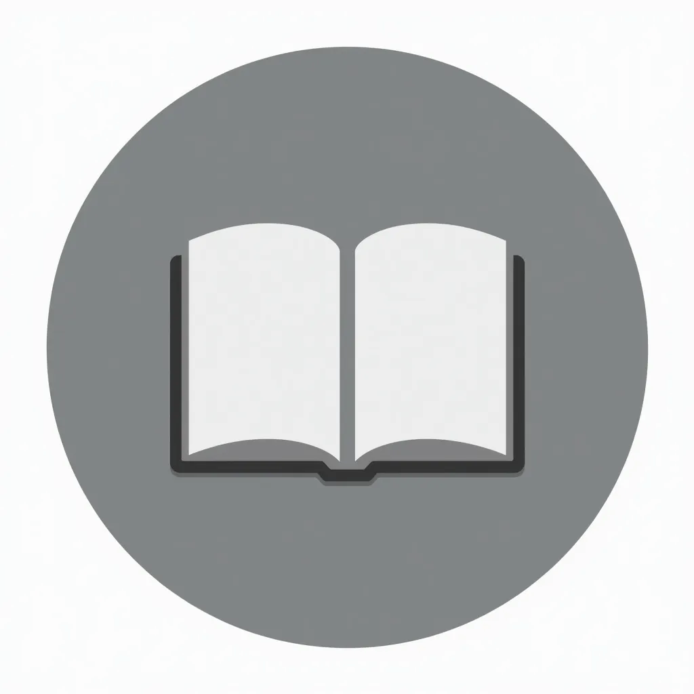
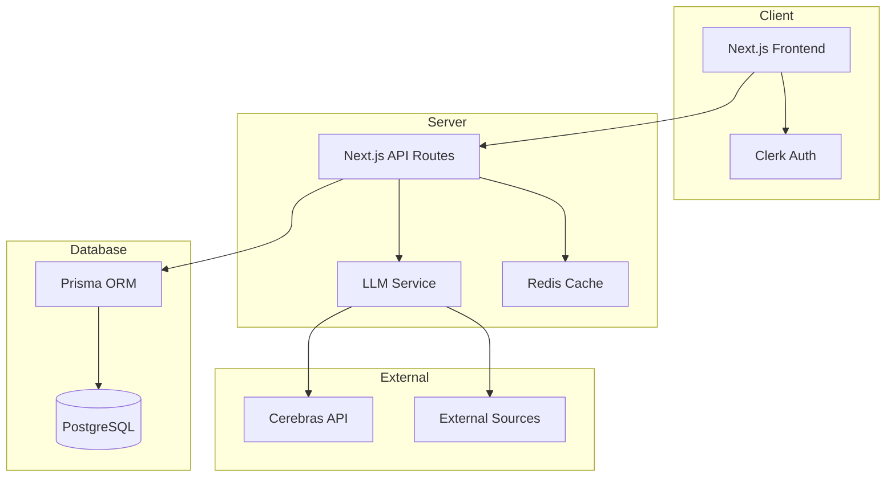

# 🌟 OpenBookLM: Democratizing Learning with AI 🌟

<!-- PROJECT SHIELDS -->
[![Contributors][contributors-shield]][contributors-url]
[![Forks][forks-shield]][forks-url]
[![Stargazers][stars-shield]][stars-url]
[![Issues][issues-shield]][issues-url]
[![MIT License][license-shield]][license-url]

<div align="center">
  <a href="https://github.com/open-biz/OpenBookLM">
    
  </a>

  <h3 align="center">OpenBookLM: Revolutionizing Content Comprehension</h3>

  <p align="center">
    Unlock the power of AI-driven learning with our open-source platform 🚀
    <br />
    <a href="https://github.com/open-biz/OpenBookLM"><strong>Explore the docs »</strong></a>
    <br />
    <br />
    <a href="https://openbooklm.com">View Demo</a>
    ·
    <a href="https://github.com/open-biz/OpenBookLM/issues">Report Bug</a>
    ·
    <a href="https://github.com/open-biz/OpenBookLM/issues">Request Feature</a>
  </p>
</div>

<!-- TABLE OF CONTENTS -->
<details>
  <summary>Table of Contents</summary>
  <ol>
    <li>
      <a href="#about-the-project">About The Project</a>
      <ul>
        <li><a href="#concept">Concept</a></li>
        <li><a href="#target-audience">Target Audience</a></li>
        <li><a href="#key-features">Key Features</a></li>
        <li><a href="#built-with">Built With</a></li>
        <li><a href="#system-architecture">System Architecture</a></li>
      </ul>
    </li>
    <li>
      <a href="#getting-started">Getting Started</a>
      <ul>
        <li><a href="#prerequisites">Prerequisites</a></li>
        <li><a href="#installation">Installation</a></li>
      </ul>
    </li>
    <li><a href="#challenges">Challenges</a></li>
    <li><a href="#advice-for-contributors">Advice for Contributors</a></li>
    <li><a href="#contributing">Contributing</a></li>
    <li><a href="#license">License</a></li>
    <li><a href="#contact">Contact</a></li>
  </ol>
</details>

<!-- ABOUT THE PROJECT -->
## About The Project

[![OpenBookLM Screen Shot][product-screenshot]](https://openbooklm.com)

> "OpenBookLM is a game-changer in the education sector, providing an open-source platform for AI-driven learning experiences." 🎓🌏

### Concept 📖

OpenBookLM is designed to bridge the gap between traditional learning methods and modern AI-driven approaches. Our platform empowers users to create and share interactive, audio-based courses, while leveraging the power of AI for enhanced learning experiences.

### Target Audience 🎯

- **Students** 📚
  - High school and university students
  - Graduate researchers
  - Academic professionals

- **Lifelong Learners** 🧠
  - Self-directed learners
  - Professional development enthusiasts
  - Knowledge seekers

### Key Features ✨

#### Open Source Framework 🔓
- Integration with various AI models
- Flexible and customizable architecture
- Community-driven development

#### Audio Course Creation 🎧
- Create and share educational podcasts
- Multilingual text-to-audio generation using Suno bark
- High-quality audio content management

#### Collaborative Learning 🌍
- Forum-like community system
- Course rating and refinement
- Knowledge sharing platform

#### Multilingual Support 🌐
- Overcome English-only limitations
- Support for multiple languages
- Inclusive learning environment

### System Architecture



### Built With

* [![Next][Next.js]][Next-url]
* [![React][React.js]][React-url]
* [![TypeScript][TypeScript]][TypeScript-url]
* [![Tailwind][TailwindCSS]][Tailwind-url]
* [![Prisma][Prisma]][Prisma-url]
* [![PostgreSQL][PostgreSQL]][PostgreSQL-url]

## Challenges ⚠️

### GPU Hosting 💻
- Managing high computational power requirements
- Optimizing resource allocation
- Cost-effective scaling solutions

### Text-to-Audio Pipelines 🗣️
- Ensuring high-quality audio output
- Managing pre-generated transcripts
- Supporting multiple languages efficiently

### Community Integration 🤲
- Building a curated content platform
- Managing user contributions
- Maintaining quality standards

## Advice for Contributors ⚡

### Rapid AI Prototyping 🌀
> "The simplest way to build an awesome product? Replicate an existing one, but add a unique twist or focus on a different market!"

Our twist:
- Open-source accessibility
- Multilingual capabilities
- Global collaboration features

### Market Gap Focus 🔍
- Addressing language restrictions
- Providing open-source alternatives
- Enabling community-driven learning

## Getting Started

To get a local copy up and running, follow these steps.

### Prerequisites

* Node.js (v20 or later)
* pnpm
  ```sh
  npm install -g pnpm
  ```
* Python (3.8 or later)

### Installation

1. Clone the repo
   ```sh
   git clone https://github.com/open-biz/OpenBookLM.git
   ```
2. Install dependencies
   ```sh
   pnpm install
   ```
3. Set up Python environment
   ```sh
   ./setup/create_venv.sh
   source venv/bin/activate
   ```
4. Create a `.env` file with your environment variables
   ```sh
   cp .env.example .env
   ```
5. Start the development server
   ```sh
   pnpm dev
   ```

<p align="right">(<a href="#readme-top">back to top</a>)</p>

## Usage

1. **Create a Notebook**: Start by creating a new notebook for your study topic
2. **Add Sources**: Upload URLs, documents, or other study materials
3. **Take Notes**: Use the AI-powered interface to take and organize notes
4. **Study & Review**: Engage with your materials through interactive features
5. **Share & Collaborate**: Join the community and share your knowledge

<p align="right">(<a href="#readme-top">back to top</a>)</p>

## Features

- Dark mode by default
- Modern UI with shadcn components
- Notebook management
- Community courses section
- Interactive chat interface
- Source management
- Notes and study tools
- Real-time updates
- Progress tracking

<p align="right">(<a href="#readme-top">back to top</a>)</p>

## Contributing

Contributions are what make the open source community such an amazing place to learn, inspire, and create. Any contributions you make are **greatly appreciated**.

1. Fork the Project
2. Create your Feature Branch (`git checkout -b feature/AmazingFeature`)
3. Commit your Changes (`git commit -m 'Add some AmazingFeature'`)
4. Push to the Branch (`git push origin feature/AmazingFeature`)
5. Open a Pull Request

<p align="right">(<a href="#readme-top">back to top</a>)</p>

## License

Distributed under the MIT License. See `LICENSE` for more information.

<p align="right">(<a href="#readme-top">back to top</a>)</p>

## Contact

Project Link: [https://github.com/open-biz/OpenBookLM](https://github.com/open-biz/OpenBookLM)

<p align="right">(<a href="#readme-top">back to top</a>)</p>

<!-- MARKDOWN LINKS & IMAGES -->
[contributors-shield]: https://img.shields.io/github/contributors/open-biz/OpenBookLM.svg?style=for-the-badge
[contributors-url]: https://github.com/open-biz/OpenBookLM/graphs/contributors
[forks-shield]: https://img.shields.io/github/forks/open-biz/OpenBookLM.svg?style=for-the-badge
[forks-url]: https://github.com/open-biz/OpenBookLM/network/members
[stars-shield]: https://img.shields.io/github/stars/open-biz/OpenBookLM.svg?style=for-the-badge
[stars-url]: https://github.com/open-biz/OpenBookLM/stargazers
[issues-shield]: https://img.shields.io/github/issues/open-biz/OpenBookLM.svg?style=for-the-badge
[issues-url]: https://github.com/open-biz/OpenBookLM/issues
[license-shield]: https://img.shields.io/github/license/open-biz/OpenBookLM.svg?style=for-the-badge
[license-url]: https://github.com/open-biz/OpenBookLM/blob/main/LICENSE
[product-screenshot]: public/screenshot.png
[Next.js]: https://img.shields.io/badge/next.js-000000?style=for-the-badge&logo=nextdotjs&logoColor=white
[Next-url]: https://nextjs.org/
[React.js]: https://img.shields.io/badge/React-20232A?style=for-the-badge&logo=react&logoColor=61DAFB
[React-url]: https://reactjs.org/
[TypeScript]: https://img.shields.io/badge/TypeScript-007ACC?style=for-the-badge&logo=typescript&logoColor=white
[TypeScript-url]: https://www.typescriptlang.org/
[TailwindCSS]: https://img.shields.io/badge/Tailwind_CSS-38B2AC?style=for-the-badge&logo=tailwind-css&logoColor=white
[Tailwind-url]: https://tailwindcss.com/
[Prisma]: https://img.shields.io/badge/Prisma-3982CE?style=for-the-badge&logo=Prisma&logoColor=white
[Prisma-url]: https://www.prisma.io/
[PostgreSQL]: https://img.shields.io/badge/PostgreSQL-316192?style=for-the-badge&logo=postgresql&logoColor=white
[PostgreSQL-url]: https://www.postgresql.org/
